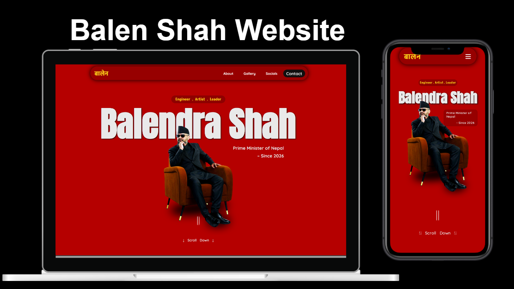

# Balen Shah Portfolio Website (Practice Project)

A clean, responsive, and fully handwritten website dedicated to Balen Shah. This project was built specifically to practice core web development skills and demonstrate responsive design.

## 🚀 Live Demo
You can view the live website here: 
**[https://adhikari-sujan.github.io/balenshah/](https://adhikari-sujan.github.io/balenshah/)**

---

## 📸 Preview
Below is a showcase of how the website looks on both Laptop and Mobile devices:



---

## ⚠️ Important Disclaimers
* **Non-Official:** This is a fan-made/practice project and is **not** an official website.
* **Non-Political:** This project is for **educational and technical practice only**. It does not serve any political purpose or agenda.

---

## 🛠 Features & Highlights

* **100% Handwritten Code:** No AI tools, page builders, or external templates were used. Every line of HTML and CSS was written from scratch.
* **Fully Responsive:** Optimized for all screen sizes, from large desktop monitors to small mobile devices.
* **Clean Design:** Focused on typography, spacing, and a professional aesthetic.

## 💻 Tech Stack
* **HTML5:** For structured and semantic content.
* **CSS3:** For styling, Flexbox/Grid layouts, and media queries.


```text
Thank You!